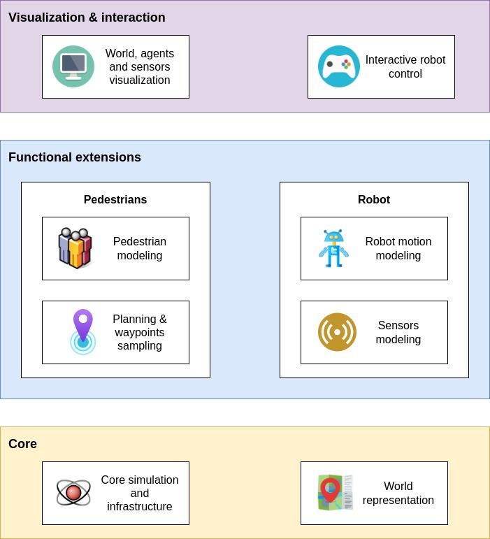

# PyMiniSim
2D simulator for mobile robot and pedestrians simulation.

---

### Current status
Current status is *version zero proof-of-concept*. Hope that we will continue active development and maintenance of the project.

### Use cases
* High-level applications and algorithms that require NPC behavious simulation much more than accurate physics simulation (e.g. planning, social navigation)
* Different educational purposes

### Roadmap
* Documentation
* Support of the maps and obstacles (now only plain environments without obstacles are supported)
* Motion noise modeling support
* Keyboard control for the robot

---

## Architecture overview

Note: current diagram display not only current architecture, but also concepts for the future updates (see roadmap).

---

## Examples

See [examples/](./examples) directory. Available examples:
* [examples/basic.py](examples/basic.py): Basic example of simulation with Headed Social Force model and simple pedestrian detector
* [examples/mpc.py](examples/mpc.py): An example of simple Model Predictive Control based navigation with [do-mpc](https://github.com/do-mpc/do-mpc) library
* [examples/orca.py](examples/orca.py): Basic example with the usage of the ORCA model for pedestrians modeling

---

## Assets

Following asset packs are used in the project:
* [Robot Pack by Kenney](https://opengameart.org/content/robot-pack)
* [2D Top Down Office Characters by BunnyHop43](https://opengameart.org/content/2d-top-down-office-characters)
